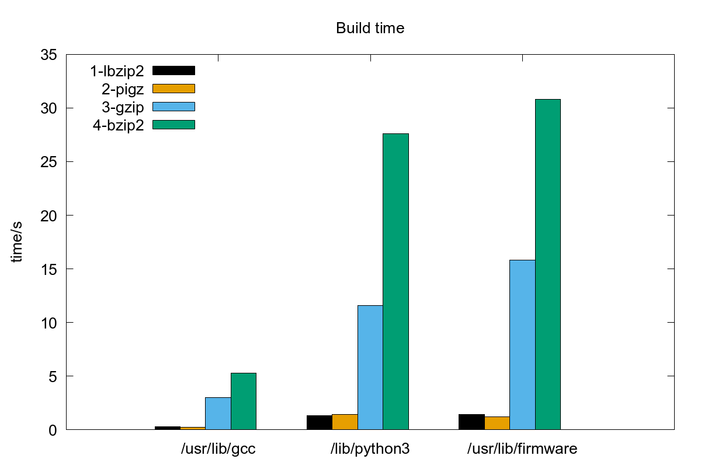

# Benchmark Procedures/Scripts

`benchmark-ab.py` is a single-file python3 script with no dependencies except
the Python3 standard library.

It will run a program/procedure iterating over a list of <stages> and <items>
while collecting execution time and printing a nice tabular output at the end.

For example, say you want to benchmark compression tool bzip2 vs pbzip2:
You would have <stages> = bzip2, lbzip2 and <items> could be a list
of filenames to compress.

Below is shown the output of running the included example (console output
is actually colored).
The included example works also as a template for your own benchmarks.

```
Iterating over stages: 1-lbzip2 2-pigz 3-gzip 4-bzip2
Iterating over items:  /usr/lib/gcc /lib/python3 /usr/lib/firmware
Running global init
Writing progress info to /tmp/benchmark-ab/benchmark-ab-example/progress.txt
Track it with: tail -F /tmp/benchmark-ab/benchmark-ab-example/progress.txt
/tmp/benchmark-ab/benchmark-ab-example/init_once_init_once
lbzip2 installed OK
pigz installed OK
gzip installed OK
bzip2 installed OK
Running init once per <item>
Running init for /usr/lib/gcc
/tmp/benchmark-ab/benchmark-ab-example/init_item_usr_lib_gcc
Running init for /lib/python3
/tmp/benchmark-ab/benchmark-ab-example/init_item_lib_python3
Running init for /usr/lib/firmware
/tmp/benchmark-ab/benchmark-ab-example/init_item_usr_lib_firmware
Running main benchmark loop
[ 1/12] Executing stage '1-lbzip2' with item '/usr/lib/gcc'
/tmp/benchmark-ab/benchmark-ab-example/1-lbzip2_usr_lib_gcc
[ 2/12] Executing stage '2-pigz' with item '/usr/lib/gcc'
/tmp/benchmark-ab/benchmark-ab-example/2-pigz_usr_lib_gcc
[ 3/12] Executing stage '3-gzip' with item '/usr/lib/gcc'
/tmp/benchmark-ab/benchmark-ab-example/3-gzip_usr_lib_gcc
[ 4/12] Executing stage '4-bzip2' with item '/usr/lib/gcc'

...

Results:
/usr/lib/gcc
/lib/python3
/usr/lib/firmware
CPU: AMD Ryzen 9 7900 12-Core Processor, 24 cores/threads

Initialization execution time:
init_once                      0.0
init_item /usr/lib/gcc         0.0
init_item /lib/python3         0.0
init_item /usr/lib/firmware    0.0

Main loop execution time results:

                           1-lbzip2                 2-pigz                 3-gzip                4-bzip2
Name                  time exit cpu   time exit cpu    rel   time exit cpu    rel   time exit cpu    rel
--------------------------------------------------------------------------------------------------------
/usr/lib/gcc           0.8    0  95    0.6    0  97   0.73    4.5    0  15   5.55    9.1    0  15  11.16
lib/python3            0.3    0  82    0.2    0  95   0.64    1.5    0  14   4.80    2.5    0  14   8.15
/usr/lib/firmware      4.4    0  99    3.1    0  92   0.71   22.0    0  15   5.00   53.7    0  33  12.22

Processed 3 items over 4 stages in 0s

Running gnuplot:
    gnuplot -e 'OUTFILE="/tmp/benchmark-ab/benchmark-ab-example/result-histogram.png"; INFILE="/tmp/benchmark-ab/benchmark-ab-example/result-time.dat"' histogram.plt
GNUplot generated histogram plot in /tmp/benchmark-ab/benchmark-ab-example/result-histogram.png

Output files are in /tmp/benchmark-ab/benchmark-ab-example
  result.txt is textual/human-readable results file
  result-time.dat is raw/final results file (used for plotting)
  result-histogram is histogram plot of final result
```

Additionally, the following histogram plot is generated:



## Installation

Install with:

```
pip install git+https://github.com/mmeisner/benchmark-ab.git
```
